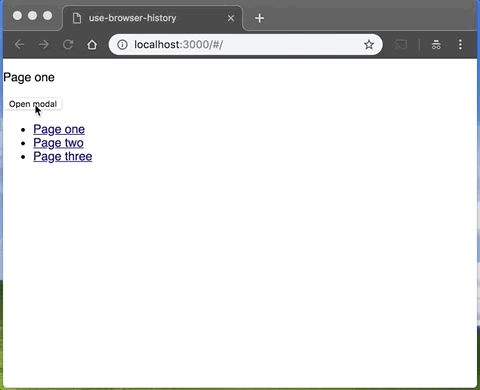

# use-browser-history

>

[](https://www.npmjs.com/package/use-browser-history) [](https://standardjs.com)



## Install

```bash
npm install --save use-browser-history
```

## Usage

```jsx
import React, { useState } from 'react'

import useBrowserHistory from 'use-browser-history'

function Modal({ isOpen, onClose, onOpen }) {
  const [handleBack] = useBrowserHistory( 'my-modal', isOpen, onClose, onOpen );

  if ( !isOpen )
    return null;

  return (
    <div className="modal">
      <div className="modal-backdrop" onClick={handleBack} />

      <div className="modal-box">
        <p>Hello!</p>
        <button onClick={handleBack}>Close modal</button>
      </div>
    </div>
  )
}

function App() {
  const [isOpen, setIsOpen] = useState( false );

  return (
    <div>
      <button onClick={() => setIsOpen( true )}>Open modal</button>

      <Modal
        isOpen={isOpen}
        onClose={() => setIsOpen( false )}
        onOpen={() => setIsOpen( true )}
      />
    </div>
  );
}
```

## License

MIT © [zcallan](https://github.com/zcallan)
