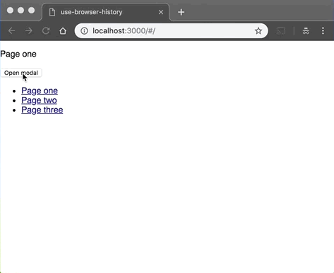

# use-browser-history

> A React hook to handle browser history events

[](https://www.npmjs.com/package/use-browser-history) [](https://standardjs.com)



https://zcallan.github.io/use-browser-history/

## Install

```bash
npm install --save use-browser-history
```

## Usage

```jsx
import React, { useState } from 'react'

import useBrowserHistory from 'use-browser-history'

function Modal({ isOpen, onClose, onOpen }) {
  const [handleBack] = useBrowserHistory( 'my-modal', isOpen, onClose, onOpen );

  if ( !isOpen )
    return null;

  return (
    <div className="modal">
      <div className="modal-backdrop" onClick={handleBack} />

      <div className="modal-box">
        <p>Hello!</p>
        <button onClick={handleBack}>Close modal</button>
      </div>
    </div>
  )
}

function App() {
  const [isOpen, setIsOpen] = useState( false );

  return (
    <div>
      <button onClick={() => setIsOpen( true )}>Open modal</button>

      <Modal
        isOpen={isOpen}
        onClose={() => setIsOpen( false )}
        onOpen={() => setIsOpen( true )}
      />
    </div>
  );
}
```

## API

```js
const [handleBack, handleForward] = useBrowserHistory( name, isActive, onBack, onForward );
```

|Key | Type | Description |
|----|------|----------|
|name|`string`|**(required)** The unique name to be used inside the browser history state. |
|isActive|`bool`|**(required)** Whether or not the entry should exist in the browser history state. *For example, in the case of a modal, this should be set to `true` when the modal is open / visible, and `false` when it's closed.*|
|onBack|`func`|A callback that is fired when the back button is pressed, or when the `handleBack` (first arg returned by `useBrowserHistory`) function is called and the browser history state has been cleaned up.|
|onForward|`func`|Exactly like `onBack`, but for the forward button. You can use this to re-perform something if the user clicks back then forward (like in the example GIF above), to do something such as re-opening a modal.|

## License

MIT © [zcallan](https://github.com/zcallan)
